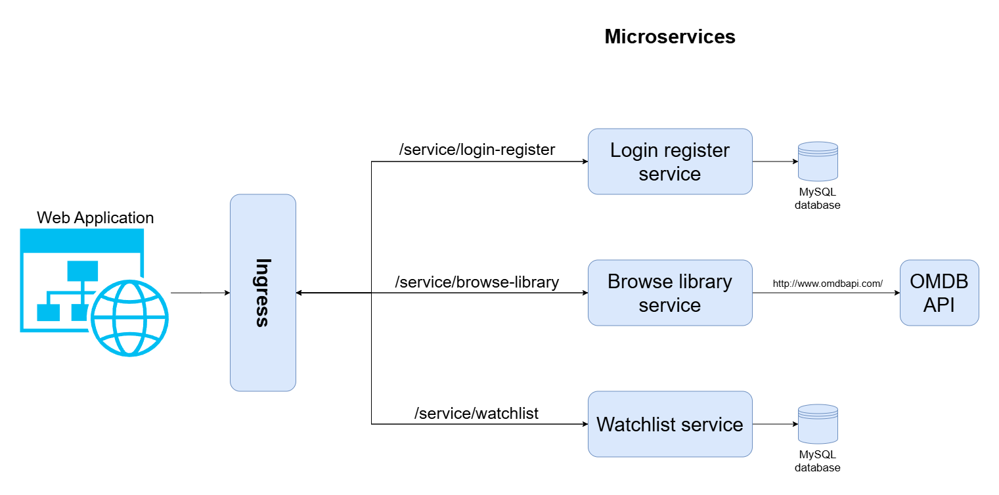

# Movie Library
An application for managing and searching for movies to watch.

## Relavant information
Application:
- http://165.227.245.243/ (prijavni podatki: email: test@a.com password: 123123)
GitHub: 
- https://github.com/markloboda/MovieLibrary
Docker hub:
- https://hub.docker.com/repository/docker/markloboda/user-interface/general
- https://hub.docker.com/repository/docker/markloboda/watchlist_service/general
- https://hub.docker.com/repository/docker/markloboda/login_register_service/general
- https://hub.docker.com/repository/docker/markloboda/browse_library_service/general

## Tools and technologies used
The main text and code editor used in the project is **Visual Studio Code**.
For version control and hosting of the project repository, I rely on **Git**, **GitHub** and **Docker Hub**.
The main web framework used in developing the backend is a **Python-based web framework Flask**, which offers a lightweight and flexible foundation with extensive community support and documentation.
For the database I use **MySql** and manage it in python with **SQLAlchemy**.
The front end is implemented using the **JavaScript Framework Vue.js**.
The application is containerized with **Docker**, orchestrated using **Kubernetes** and deployed on the platform **Digital Ocean**.

## Documentation

### Folder structure
- assets - All the images and files used in the project.
- certs - Certificates for the application.
- k8s - Kubernetes manifests (YAML files) for deployment and orcestration.
- scripts - Usefull scripts for deploying and building the application.
- src - Source code with each service in its own directory.
- tests - Tests for the application.

### Deployment
1. Install:
- kubectl
- doctl
- Docker
- node.js (npm)

2. Make sure you have all the necesary tools installed.
3. Get Digital Ocean cluster **Config File**.
4. Connect to a Kubernetes cluster with "doctl".
5. Go to root directory of the project.
6. Run:
   - ./scripts/docker-build-push.ps1
   - ./scripts/k8s-deploy.ps1
