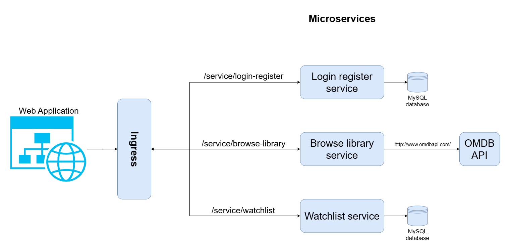

# Movie Library
## Authors:
- Mark Loboda (ml7363@student.uni-lj.si) - Skupina: Samostojno 10

## Links
Application:
- http://165.227.245.243/ (prijavni podatki: email: test@a.com password: 123123)

GitHub:
- https://github.com/markloboda/MovieLibrary

Docker Hub:
- https://hub.docker.com/repository/docker/markloboda/user-interface/general
- https://hub.docker.com/repository/docker/markloboda/watchlist_service/general
- https://hub.docker.com/repository/docker/markloboda/login_register_service/general
- https://hub.docker.com/repository/docker/markloboda/browse_library_service/general

## Description
Movie Library is an application that allows users access to a collection of movies and is designed to simplify and improve the process of browsing for movies, keeping track of movies to watch, and the ones already watched. The main issues it solves are browsing for new movies, and creating watchlists of new movies. It does so by implementing a cloud web application with access to a movie database, allowing the user to search through it with the browse library service. It also implements a watchlist service, where users can add any movie to the list and view it any time.

## Tools and technologies used
The main text and code editor used in the project is Visual Studio Code.
For version control and hosting of the project repository, I rely on Git, GitHub, and Docker Hub.
The main web framework used in developing the backend is a Python-based web framework, Flask, which offers a lightweight and flexible foundation with extensive community support and documentation.
For the database, I use MySQL and manage it in Python with SQLAlchemy.
The front end is implemented using the JavaScript framework Vue.js.
The application is containerized with Docker, orchestrated using Kubernetes, and deployed on the platform Digital Ocean.

## Architecture schema

## List of microservice functionalities
- Login register microservice
  - Creating a new user and adding it to the database of all users.
  - Logging into an existing user.
  - Logging out of an account.
  - The ability to check the JWT token for validity and return the user.

- Browse movies microservice
  - Search for movies on the movie database.

- Watchlist microservice
  - Add a movie to the watchlist.
  - Get all movies from the watchlist.
  - Remove a movie from the watchlist.

## Use cases
1. Nov uporabnik pride na aplikacijo in ustvari račun.
2. Obstoječ uporabnik se prijavi v aplikacijo.
3. Uporabnik brez računa išče filme.
4. Uporabnik se prijavi v aplikacijo in išče filme. Nato doda film na seznam za ogled.
5. Uporabnik se prijavi v aplikacijo in išče filme. Nato odstrani film iz seznama za ogled.
6. Uporabnik se prijavi v aplikacijo in išče filme. Nato si ogleda seznam filmov za ogled. Odstani film iz seznama za ogled. Nato se odjavi iz aplikacije.

## Requirements

### Repository
- Used a GitHub repository for my version control. 
- As I was working alone, I used the main branch that had the production-ready code and the develop branch with development code. 
- When development code was ready and tested, I merged the develop branch into the main branch.
-  Also added instruction on how to deploy the application and what tools are needed.

### Microservices and cloud-native applications:
- I used Visual Studio Code.
- used a folder structure with separated configuration files, service code, and tests folder;
- Added instruction on how to deploy the application;
- implemented 3 microservices;
- Microservices communicate via HTTP.
- used Kubernetes manifests for deployment;
- used MySQL for the database and accessed it within the login register service and watchlist service.

### Documentation
- Added documentation for how to deploy the application, including all the necessary tools.
- Added a folder structure with a description of each folder.
- Added a diagram of the architecture schema.
- Added documentation for the REST API of each microservice.

### API Documentation
- Added swagger/OpenAPI documentation for each microservice with the endpoint for documentation.
- Also includes formats of the request and response bodies and the status codes.

### Deployment
- Deployed my application with DigitalOcean. The Kubernetes cluster with the web application is accessible on http://165.227.245.243/.

### Serverless function
- Implemented a serverless function to sort movies by year or title. The function is accessible via the browse library service.
- The serverless function adjusts power automatically.

### External API
- Used an external API called OMDB API for data about movies. I accessed it within the browser library service.

### Health checks
- Implemented health checks for each microservice to check liveness.
- Calling health checks and checking liveness of service. If the service is not live, it will restart.
- Implemented a demo of the health check in the browse library service and user interface.

### Configuration management
- Deployed etcd server.
- Support for choosing DEBUG mode or PRODUCTION mode without restarting services.
- Implementation and configurations separated and allow for configuration changes without recompiling and installing the microservices.
- Use of DB_URI for the database connection, JWT_SECRET_KEY for jwt token, and OMDB_API_KEY for the external API.

### Graphical user interface
- Implemented a graphical user interface in Vue.js, which allows access to all the functionalities of the microservices via REST APIs.

### Ingress Controller
- Implemented an NGINX Ingress Controller for access to all the functionalities of the application.